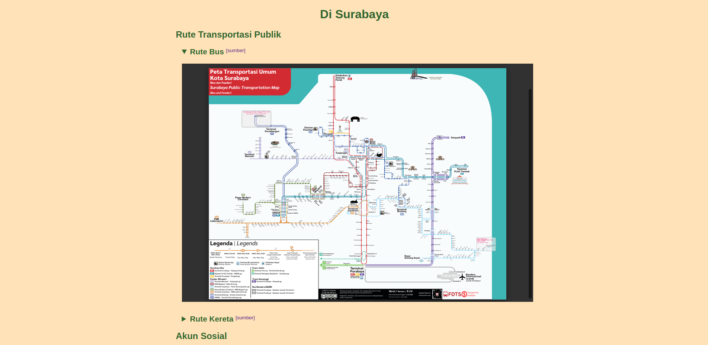
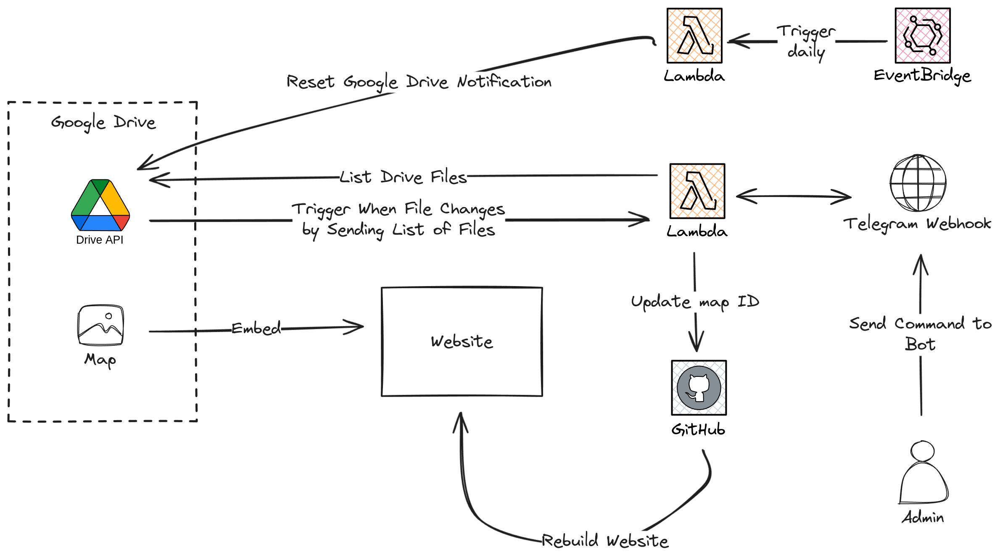

# di-surabaya (Di Surabaya)

di-surabaya (Di Surabaya) is a website that aims to collect information about Surabaya city that is scattered
on different website. This web is made for personal use who wants to get information in a single page rather
than clicking through different links.

This repository contains the codebase that is used to build the website. The source code can be found inside
the [src](./src) folder. There are 3 folders inside it:

1. **Bot**: This folder contains source code of a bot that is used by admin to update information and receives notification
2. **GoogleDriveNotificationReset**: This folder contains source code to reset Google Drive notification
3. **Web**: This folder contains the source code of the website.

## Architecture Overview

This project is made using the following tools:

- [.NET](https://dotnet.microsoft.com/en-us/download/dotnet/8.0) 8.0.104
- [NodeJS](https://nodejs.org/en/download/prebuilt-installer) 20.12.2

Below is the overview of diagram of the project
 

Since the website is just collecting information from different source, an automation is required to monitor
and update information from the source. Hence, this architecture is made to accomodate that purpose. The website 
embedded a content from Google Drive. This content is created and updated by third party. Since there is no way 
to know when and how it's updated, Google Drive [Notification API](https://developers.google.com/drive/api/guides/push)
is used to keep track of any change on the file. When something is changed, a webhook will be triggered to send 
request to particular service. The service that received this is an AWS Lambda which responsible to handle any 
webhook. After receiving this request, it will trigger a Telegram Webhook which trigger a bot to send a message
containing a list of file in the Google Drive. This message will be received and evaluated by admin.

Although Google Drive Notification API is useful to keep track of file changes, it has a [limitation](https://developers.google.com/drive/api/guides/push#renew-notification-channels)
which it is needed to reset notification channel expiration periodically. So a scheduler is needed to
automatically reset the notification. AWS EventBridge is used to accomodate this and it triggers AWS Lambda
which then call the Google Drive Notification API to reset the notification periodically.

A bot is used to update the website which is controlled by admin. At the moment, the bot can only update
the map since it's the only content that is likely to change in frequent. When admin send a command to the
bot to change the map, AWS Lambda receives the trigger and then request Github API to update
the map ID that is stored as environment variable. Once it's updated, it makes another request to Github API
to rebuild the website with the new map.
